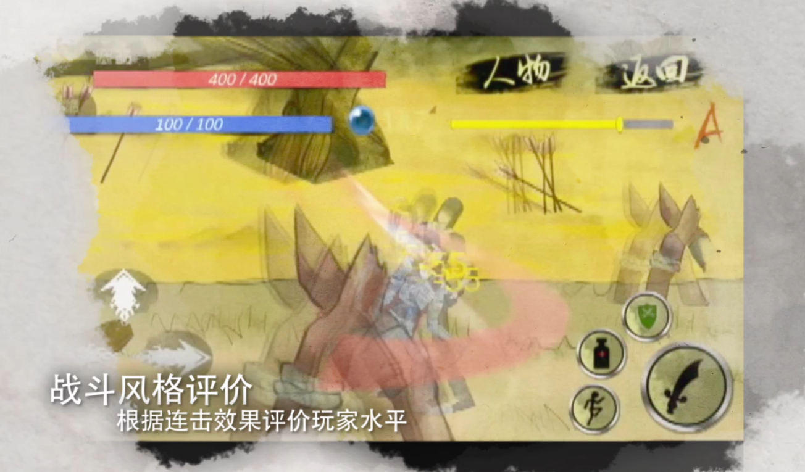

# NewGame
一款参赛作品，2D的ARPG。 
基本的操作包括移动，跳跃，攻击，补给。方向键与攻击有不同的组合效果，如上挑攻击可以将敌人击飞，起跳后下劈攻击可以将敌人震开等等。 
基本的红蓝条，击打敌人可以回蓝，用于领悟技能。 
其他主要系统包括： 
&nbsp;&nbsp;&nbsp;&nbsp;&nbsp;1.技能系统：攻击周围的两个辅助键位可以放置两个选择的技能，技能的领悟需要蓝。 
&nbsp;&nbsp;&nbsp;&nbsp;&nbsp;2.阵牌系统：被动技能，可以提升角色属性。 
&nbsp;&nbsp;&nbsp;&nbsp;&nbsp;3.成就系统：可以在游戏中解锁。 
&nbsp;&nbsp;&nbsp;&nbsp;&nbsp;4.资料系统：图鉴，显示击杀过的敌人。 
&nbsp;&nbsp;&nbsp;&nbsp;&nbsp;5.评级系统：通过各项数值评价玩家的过关评分。其中连击评级显示在面板，分为DCBAS5级。连击得分会随时间下降，随着攻击敌人得分会回升，故连击可以得到更高的分数。 

截图取自宣传视频：

